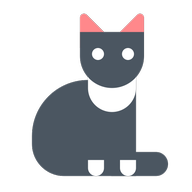

<div align="center">
    
</div>


<h1 align="center">CatOnly</h1>
<p align="center">Uma aplicação Flutter que mostra gatos :)</p>

<p align="center">
    <a href="#first_steps">Primeiros passos</a> | 
    <a href="#objective">Objetivo</a> | 
    <a href="#technology">Tecnologia</a> | 
    <a href="#monorepo">Monorepo</a> | 
    <a href="#aditional_info">Informações adicionais</a> | 
    <a href="#author">Autor</a>
</p>


## Primeiros passos

<p id="#first_steps">
    <h2>Primeiros passos</h2>
    <p>
    Após obter o código, é necessário gerar sua chave para acessar a API.
    Primeiramente, não é necessário obter a chave, contudo há um baixo limite te solicitações. Por isso, vale mais tirar sua chave.
    </p>
    <p>
    Acesse o site da API: <p><a href="https://thecatapi.com/">Clique aqui</a></p>
    </p>
    <p>Lembro que esta API não é minha!</p>
    <h3>Adicionando a chave ao código</h3>
    <p>
    Vá ao aquivo em: cat_api/lib/api/external/cat_datasource_impl.dart<br/><br/>
    você encontrará a linha:
    <pre>'x-api-key': Keys.xApiKey,</pre>
    <br/>
    Então crie o arquivo Keys na pasta domain/endpoints e adicione o atributo estático
    <pre>xApiKey</pre>
    e pronto.
    </p><br/>
    <p>Lembrando que esse é o procedimento adotado. Caso queira fazer de alguma outra forma, sinte-se livre para isto.</p>
</p>

<p>Classe que deverá ser criada concordante as instruções acima:</p>

```dart
class Keys {
  static const xApiKey = 'YOUR_KEY';
}
```

<p id="#objective">
    <h2>Objetivo</h2>
    <p>
    - Aprender mais sobre monorepo
    - Melhorar os conceitos de SOLID
    - Aumentar as noções de GitFlow

    - Criar a interface com diferentes formas de gerenciar o estado:
    - ChangeNotifier e ValueNotifier
    - MobX sem o build_runner

    - Melhorar as noções de testes: unitários, de widget, de integração e de mutação
    </p>
</p>

<p id="#technology">
    <h2>Tecnologia</h2>
    <p><a href="https://flutter.dev/" target="_blank">Flutter</a> at 3.3.0 - channel stable</p>
</p>

<p id="#monorepo">
    <h2>Monorepo</h2>
    <a href="https://github.com/RODRIG0RIVAS/cat_only/cat_only" target="_blank">CatOnly App</a><br/>
    <a href="https://github.com/RODRIG0RIVAS/cat_only/cat_api" target="_blank">CatOnly API</a><br/>
    <a href="https://github.com/RODRIG0RIVAS/cat_only/dependency" target="_blank">Dependências</a><br/>
    <a href="https://github.com/RODRIG0RIVAS/cat_only/core" target="_blank">Core</a><br/>
    <a href="https://github.com/RODRIG0RIVAS/cat_only/miados" target="_blank">Design System</a><br/>
</p>

<p id="#aditional_info">
    <h2>Informações adicionais</h2>
    <p>Não esqueça de executar o build_runner em:

    - cat_only
    - cat_api

    Estas execuções terão efeito nos testes
    </p>
</p>

<p id="#author">
    <h2>Autor</h2>
    <p>Desenvolvido por Rodrigo Rivas</p>
    <a href="https://www.linkedin.com/in/rodrigo-rivas-dev/" target="_blank">LinkedIn</a>
</p>